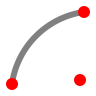

Arc
===

**Alias:** ``A``

Creates an arc defined by a centre point, start point, and end point.

----

Description
-----------

The Arc command creates a circular arc. The arc is defined by specifying a centre point, then the start point and end point in an anti-clockwise direction.

Workflow
--------

1. Type ``A`` and press ``Space`` or ``Enter``.
2. **Specify centre point:** Click the centre of the arc.
3. **Specify start point:** Click the point where the arc begins.
4. **Specify end point:** Click the point where the arc ends.

.. note::
   The arc is drawn anti-clockwise from the start point to the end point.

Tips
----

- Use object snap to align the start or end of the arc precisely with existing geometry.
- To create a precise arc, type coordinates for each point rather than clicking.
- Arcs can be used as cutting edges in :doc:`trim`.

DXF Representation
-------------------

An arc is stored as an ``ARC`` entity in the DXF :doc:`../dxf` ``BLOCKS`` section. An ``ARC`` shares the same group codes as ``CIRCLE`` with the addition of start and end angles.

.. code-block:: text

   0
   ARC
   8       ← layer name
   0
   10      ← centre X
   50.0
   20      ← centre Y
   50.0
   40      ← radius
   25.0
   50      ← start angle (degrees, anti-clockwise from positive X)
   30.0
   51      ← end angle (degrees, anti-clockwise from positive X)
   150.0

Angles are always measured anti-clockwise from the positive X-axis.

See Also
--------

:doc:`circle` | :doc:`trim` | :doc:`../dxf`
