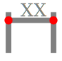

Dimension
=========

**Alias:** ``D I M``

Creates a dimension annotation to measure and display the size of objects.

----

Description
-----------

The Dimension command adds annotative dimensions to your drawing. Depending on the selected object and pick points, Design will automatically create the most appropriate dimension type — linear, aligned, angular, radial, or diameter.

Workflow
--------

1. Type ``D I M`` and press ``Space`` or ``Enter``.
2. **Select object or specify first point:** Click an existing object to dimension it automatically, or click a point to start a manual dimension.
3. **Specify second point** *(if picking points manually)*: Click the second measurement point.
4. **Specify dimension line location:** Click to position the dimension line away from the object.

Dimension Types
---------------

============================    ==============================================
Type                            When it is created
============================    ==============================================
Linear                          Two points sharing the same horizontal or vertical axis
Aligned                         Two points at an angle (measures true length)
Angular                         Two lines forming an angle
Radial                          Circle or arc (measures radius)
Diameter                        Circle (measures diameter)
============================    ==============================================

Tips
----

- Dimension appearance (text height, arrow size, units) is controlled by the active dimension style.
- Position the dimension line far enough from the object to keep the drawing readable.
- Select multiple objects to create a series of dimensions efficiently.

DXF Representation
-------------------

Dimensions are stored as ``DIMENSION`` entities in the DXF :doc:`../dxf` ``BLOCKS`` section. The entity references a named dimension style and stores the defining geometry points.

.. code-block:: text

   0
   DIMENSION
   8        ← layer name
   0
   2        ← name of the block containing the dimension geometry
   *D0
   3        ← dimension style name
   Standard
   70       ← dimension type flag
            ← 0=linear, 1=aligned, 2=angular, 3=diameter, 4=radius
   1
   10       ← definition point X (varies by type)
   0.0
   20       ← definition point Y
   0.0
   11       ← text mid-point X
   50.0
   21       ← text mid-point Y
   10.0
   1        ← override text (empty = use measured value)

Dimension appearance (arrowheads, text height, tolerances) is controlled by the dimension style recorded in the ``TABLES`` section.

See Also
--------

:doc:`../dimensions` | :doc:`../dxf`
