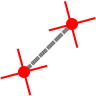

Distance
========

**Alias:** ``D I``

Measures the distance between two points.

----

Description
-----------

The Distance command calculates and displays the straight-line distance between two picked points. The result is shown on the command line. This command does not modify the drawing.

Workflow
--------

1. Type ``D I`` and press ``Space`` or ``Enter``.
2. **Specify first point:** Click the start of the measurement.
3. **Specify second point:** Click the end of the measurement.
4. The distance is displayed on the command line.

Tips
----

- Use object snap to pick exact points such as endpoints, midpoints, or centres for accurate measurements.
- The command is non-destructive — it only reads coordinates and reports the result.
- Use :doc:`identify` to find the absolute coordinates of a single point rather than the distance between two.

See Also
--------

:doc:`identify`
