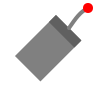

Explode
=======

**Alias:** ``X``

Breaks a compound object into its component objects.

----

Description
-----------

The Explode command decomposes compound objects — such as polylines, rectangles, and blocks — into their individual component entities. For example, a rectangle becomes four separate line segments, and a block becomes the objects it was defined from.

Workflow
--------

1. Type ``X`` and press ``Space`` or ``Enter``.
2. **Select objects:** Click the compound objects to explode, then press ``Enter`` to confirm.
3. The selected objects are replaced by their individual components.

.. warning::
   Exploding a block removes the block reference and replaces it with individual geometry. This operation cannot be undone cleanly if the drawing has many instances of the block. Use ``Ctrl+Z`` to undo if needed.

Tips
----

- After exploding a rectangle, you can use :doc:`trim` or :doc:`extend` on individual segments.
- Exploded objects may change in appearance if the block had a different colour or layer setting from its components.
- Use ``Ctrl+Z`` immediately to undo an accidental explode.

See Also
--------

:doc:`block` | :doc:`polyline`
