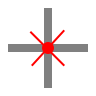

Identify
========

**Alias:** ``I D``

Displays the UCS coordinates of a specified point.

----

Description
-----------

The Identify command reports the X and Y coordinates of a point you pick on the canvas. The result is displayed on the command line. This command is useful for checking the absolute position of a point in the drawing. It does not modify the drawing.

Workflow
--------

1. Type ``I D`` and press ``Space`` or ``Enter``.
2. **Specify point:** Click the point whose coordinates you want to know.
3. The X and Y coordinates are displayed on the command line.

Tips
----

- Use object snap to pick the exact position of an endpoint, midpoint, centre, or other geometric point.
- Use :doc:`distance` to measure the distance between two points rather than reporting a single coordinate.

See Also
--------

:doc:`distance`
