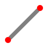

Line
====

**Alias:** ``L``

Creates one or more connected line segments.

----

Description
-----------

The Line command draws straight line segments between two or more points. Each segment is a separate object. Lines can be continued from the endpoint of the previous line by pressing ``Space`` at the start point prompt.

Workflow
--------

1. Type ``L`` and press ``Space`` or ``Enter``.
2. **Specify first point:** Click a point on the canvas or type coordinates (e.g. ``10,20``).
3. **Specify next point:** Click the next point or type a distance and angle.
4. Continue specifying points to draw further connected segments.
5. Press ``Enter`` or ``Escape`` to end the command.

Tips
----

- Use :doc:`ortho` (``F8``) to constrain lines to horizontal or vertical directions.
- Use :doc:`../commands` object snap to start or end lines precisely on existing geometry.
- Press ``Space`` at the *Specify first point* prompt to continue from the last drawn point.
- Type coordinates directly (``x,y``) for precise placement.

DXF Representation
-------------------

A line is stored as a ``LINE`` entity in the DXF :doc:`../dxf` ``BLOCKS`` section.

.. code-block:: text

   0
   LINE
   8       ← layer name
   0
   10      ← start point X
   0.0
   20      ← start point Y
   0.0
   11      ← end point X
   100.0
   21      ← end point Y
   100.0

Each segment created by the Line command becomes a separate ``LINE`` entity. To store connected segments as a single entity, use :doc:`polyline` (``LWPOLYLINE``).

See Also
--------

:doc:`polyline` | :doc:`rectangle` | :doc:`../dxf`
