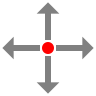

Move
====

**Alias:** ``M``

Moves selected objects from one location to another.

----

Description
-----------

The Move command relocates selected objects by a specified displacement. Objects can be selected before or after starting the command. The displacement is defined by picking a base point and then a destination point, or by typing a distance.

Workflow
--------

**Select-first method (recommended):**

1. Select the objects you want to move.
2. Type ``M`` and press ``Space`` or ``Enter``.
3. **Specify base point:** Click a reference point on or near the selection.
4. **Specify destination point:** Click where the base point should move to.

**Command-first method:**

1. Type ``M`` and press ``Space`` or ``Enter``.
2. **Select objects:** Click objects to select them, then press ``Enter``.
3. **Specify base point:** Click a reference point.
4. **Specify destination point:** Click the destination.

Tips
----

- Use object snap to pick base and destination points precisely (e.g. snap to an endpoint, then to another endpoint).
- Type a relative displacement (e.g. ``@100,0``) to move objects an exact distance.
- Use :doc:`copy` to duplicate objects at a new location instead of moving them.

See Also
--------

:doc:`copy` | :doc:`rotate`
