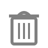

Purge
=====

**Alias:** ``P U``

Removes unused named objects from the drawing.

----

Description
-----------

The Purge command deletes named objects that are defined in the drawing but not currently used by any entities. This can include unused layers, line types, text styles, dimension styles, and block definitions. Purging reduces file size and keeps the drawing tidy.

Workflow
--------

1. Type ``P U`` and press ``Space`` or ``Enter``.
2. The command automatically removes all unused named objects from the drawing.

.. note::
   Some named objects may be protected and cannot be purged (for example, the ``0`` layer and the ``CONTINUOUS`` line type).

Tips
----

- Run Purge after deleting blocks, unused layers, or imported styles to keep the drawing clean.
- Purge only removes objects that are genuinely unused — objects referenced by entities in the drawing are kept.
- Use the Layers panel (``Ctrl+L``) to check which layers exist before purging.

See Also
--------

:doc:`erase`
