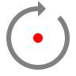

Rotate
======

**Alias:** ``R O``

Rotates selected objects about a base point by a specified angle.

----

Description
-----------

The Rotate command revolves selected objects around a specified base point. The rotation angle is measured anti-clockwise from the positive X-axis. The angle can be specified by picking a point on the canvas or by typing a value.

Workflow
--------

**Select-first method (recommended):**

1. Select the objects you want to rotate.
2. Type ``R O`` and press ``Space`` or ``Enter``.
3. **Specify base point:** Click the point around which objects should rotate.
4. **Specify rotation angle:** Click a point to define the angle visually, or type an angle in degrees and press ``Enter``.

**Command-first method:**

1. Type ``R O`` and press ``Space`` or ``Enter``.
2. **Select objects:** Click the objects, then press ``Enter``.
3. **Specify base point:** Click the pivot point.
4. **Specify rotation angle:** Click or type the angle.

Tips
----

- Angles are measured anti-clockwise; use negative values for clockwise rotation (e.g. ``-90``).
- Use an endpoint or centre point as the base point for predictable results.
- To rotate a copy while keeping the original, use :doc:`copy` after rotating.

See Also
--------

:doc:`move` | :doc:`copy`
