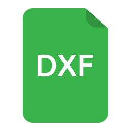

DXF File Format
===============

Design reads and writes the **DXF (Drawing Exchange Format)**, an open file format originally developed by Autodesk as the interoperability standard for CAD drawings. DXF files can be opened by virtually all CAD applications and are the primary way to share drawings created in Design.

----

Overview
--------

DXF is a plain-text (ASCII) format. Each file is a sequence of **group code / value pairs** — an integer group code on one line followed by its value on the next. The group code identifies what the value means:

.. code-block:: text

   0        ← group code: entity type
   LINE     ← value: this is a LINE entity
   10       ← group code: X coordinate of start point
   100.0    ← value
   20       ← group code: Y coordinate of start point
   50.0     ← value

Group codes are consistent across entity types — for example, group code ``10`` always represents the primary X coordinate of an entity regardless of which entity type it belongs to.

----

File Structure
--------------

A DXF file is divided into named **sections**, each beginning with a ``SECTION`` marker and ending with ``ENDSEC``. The sections appear in the following order:

.. list-table::
   :header-rows: 1
   :widths: 20 80

   * - Section
     - Purpose
   * - ``HEADER``
     - Drawing-wide variables: units, limits, current layer, snap settings, etc.
   * - ``CLASSES``
     - Application-defined object classes (rarely edited manually).
   * - ``TABLES``
     - Named object definitions: layers, line types, text styles, dimension styles, and block record table.
   * - ``BLOCKS``
     - Block definitions, including the implicit ``*Model_Space`` block that holds all entities on the canvas.
   * - ``ENTITIES``
     - All drawing entities in model space (legacy; modern files store entities in ``BLOCKS``).
   * - ``OBJECTS``
     - Non-graphical objects such as dictionaries and extended data.

----

Common Group Codes
------------------

The following group codes appear in almost every entity:

.. list-table::
   :header-rows: 1
   :widths: 15 85

   * - Code
     - Meaning
   * - ``0``
     - Entity type name (e.g. ``LINE``, ``CIRCLE``, ``ARC``)
   * - ``5``
     - Entity handle — a unique hex identifier
   * - ``6``
     - Line type name (``BYLAYER`` if inherited from the layer)
   * - ``8``
     - Layer name
   * - ``10``, ``20``
     - Primary point X and Y coordinates (start point, centre, or insertion point)
   * - ``11``, ``21``
     - Secondary point X and Y coordinates (end point or direction)
   * - ``39``
     - Thickness (extrusion depth; ``0`` for flat 2D entities)
   * - ``62``
     - Colour number (``256`` = BYLAYER)
   * - ``370``
     - Line weight (``-1`` = BYLAYER)

----

DXF Entities
------------

Each drawing entity has its own set of required group codes in addition to the common ones above. The pages below describe how each Design entity is represented in DXF:

- :doc:`commands/line` — ``LINE`` entity
- :doc:`commands/circle` — ``CIRCLE`` entity
- :doc:`commands/arc` — ``ARC`` entity
- :doc:`commands/polyline` — ``LWPOLYLINE`` entity
- :doc:`commands/rectangle` — ``LWPOLYLINE`` entity (closed flag set)
- :doc:`commands/text` — ``TEXT`` entity
- :doc:`commands/hatch` — ``HATCH`` entity
- :doc:`commands/dimension` — ``DIMENSION`` entity
- :doc:`commands/block` — ``BLOCK`` definition + ``INSERT`` entity

----

Further Reading
---------------

- `DXF Reference (Autodesk) <https://help.autodesk.com/view/OARX/2024/ENU/?guid=GUID-235B22E0-A567-4CF6-92D3-38A2306D73F3>`_
- `AutoCAD DXF — Wikipedia <https://en.wikipedia.org/wiki/AutoCAD_DXF>`_
