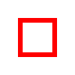
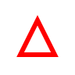
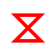
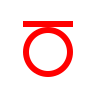
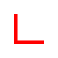

Object Snaps
============

Object snaps (osnaps) cause the cursor to lock onto a specific geometric point on a nearby entity when you are picking a point.
When an osnap is active a marker is displayed on the candidate point and the type of snap is shown.

Snaps can be toggled on or off individually in **Settings → Snaps**, or toggled all at once with ``F9``.

Snap Override
-------------

A snap override forces the *next pick only* to use a specific snap type, ignoring all other active snaps.
It is useful when you need a precise single-use snap without changing your permanent snap settings.
Access snap overrides through the right-click context menu under **Snap Override**.

----

Snap Types
----------

Endpoint
~~~~~~~~

Snaps to the nearest endpoint of a line, arc, or polyline segment.
Use this when you need to connect geometry exactly at the end of an existing entity.

Midpoint
~~~~~~~~

Snaps to the midpoint of a line, arc, or polyline segment.
Use this to bisect a line or to align geometry with the centre of a segment.

Centre
~~~~~~

Snaps to the centre point of a circle, arc, or ellipse.
Use this to draw from or to the exact centre of a circular entity.

Quadrant
~~~~~~~~

Snaps to the four cardinal points of a circle or arc — the points at 0°, 90°, 180°, and 270°.
These correspond to the rightmost, topmost, leftmost, and bottommost points of the curve.
Use this when you need to connect to the extents of a circle rather than its centre.

Nearest
~~~~~~~

Snaps to the geometrically closest point on any entity to the current cursor position.
Use this when you need a point that lies exactly on an entity's boundary but is not one of the other snap candidates.

Tangent
~~~~~~~

Snaps to the point on a circle or arc where a line drawn from the previous point would be tangent to the curve.
Use this to draw tangent lines between a point and a circle, or between two circles.

Node
~~~~

Snaps to a point entity.
Use this to connect geometry to a discrete point that has been placed in the drawing.

Perpendicular
~~~~~~~~~~~~~

Snaps to the point on an entity where a line from the previous point would meet it at exactly 90°.
Use this to draw lines that are perpendicular to an existing line, arc, or circle.

----

See Also
--------

:doc:`/pages/tracking` | :doc:`/pages/command-line` | :doc:`/pages/shortcuts`
