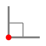

Tracking
========

Tracking constrains the direction of new points to specific angles, helping you draw accurately without typing coordinates.

----

Ortho Mode
----------

Ortho mode constrains all cursor movement to horizontal or vertical directions only.
When ortho is active you can only pick points that are exactly 0°, 90°, 180°, or 270° from the previous point.

This is the fastest way to draw perfectly horizontal or vertical lines without typing coordinates.

Toggle with ``F8`` or through **Settings → Tracking**.

Polar Tracking
--------------

Polar tracking constrains the cursor to snap to lines at specific angular increments from the previous point.
When the cursor is close to a tracked angle a coloured tracking line is displayed and the cursor snaps to that direction.

The angular increment is configured in **Settings → Tracking → Polar Angle**.
Available increments are 5°, 10°, 15°, 22.5°, 30°, 45°, and 90°.

For example, with a 30° polar angle set, the cursor will snap to 0°, 30°, 60°, 90°, 120°, 150°, 180°, and so on.

Toggle with ``F10`` or through **Settings → Tracking**.

.. note::
   Ortho mode and polar tracking are mutually exclusive — enabling one disables the other.

----

See Also
--------

:doc:`/pages/object-snaps` | :doc:`/pages/command-line` | :doc:`/pages/shortcuts`
